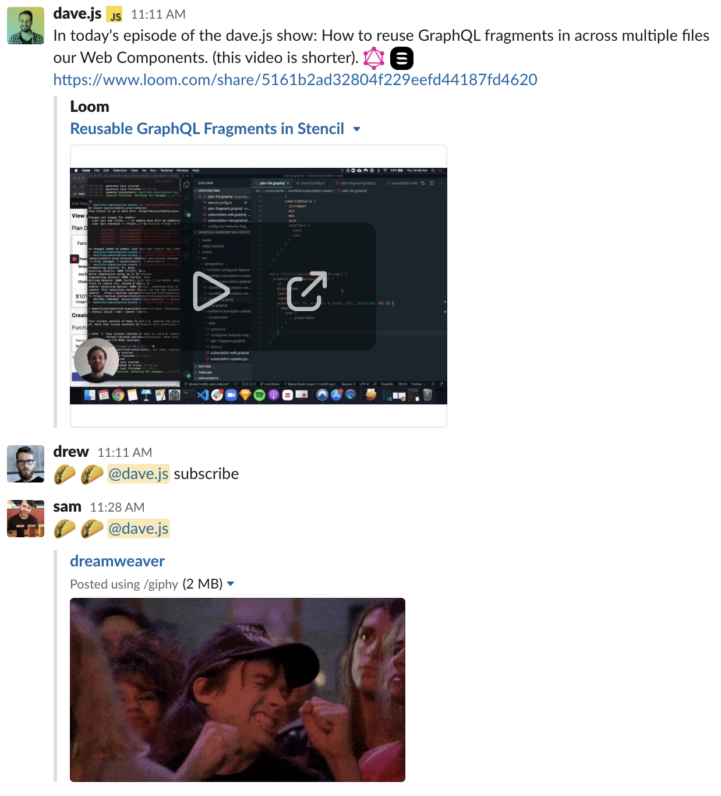

In my last post I explained how [the biggest problem with remote work is not the distance, but the scheduling conflicts](https://davejs.dev/the-real-problem-with-remote-communication/). This is a followup post to that, so go read that first and then come back. Or don’t, I’m not your boss.

Now that you’re all caught up, let’s dive into how I’ve been changing how I communicate to better suit a remote environment.

## Experimenting with Loom for one month 👨‍🔬

> Writing is horrendously inefficient at quickly and accurately communicating complex  ideas.

As I shared in my last post, meetings don’t always work well for remote teams. Finding a meeting time that works across many timezones is near impossible. This often forces us to fall back on async communication tools that rely on writing such as Google Docs and Slack. But writing is horrendously inefficient at quickly and accurately communicating complex ideas. It’s a low throughput medium that requires significant time and effort to properly distill our thoughts. 

Remote work is new to all of us. Even those of us who have done it for a while don’t have it all figured out. The processes and tools for in-person collaboration and communication have been refined over hundreds of years while those for remote communication have only had about a decade of evolution. That means there’s plenty of opportunity for innovation in the processes and tools surrounding remote work. We must explore new ways of working if we are to discover what works best in this brave new remote-first world.

My hypothesis: a better remote communication should be:

✅ Asynchronous, allowing people to participate on their own time

✅ A high throughput medium, making the information easy to both produce and consume.

Over the past month, I’ve been conducting an experiment at work. Every time I’d make a pull request I’d attach a video explaining my code changes. Every time someone asked a question in Slack that required a complex or lengthy explanation, I’d respond with a video. Every time I felt inclined to write a wall of text — I didn’t. I opened Loom and recorded a video instead.

> Loom is an app that records your screen and webcam simultaneously and instantly lets you share it with anyone online

Loom is actually an essential piece of this solution. If you’re not familiar with it, Loom is an app that records your screen and webcam simultaneously and instantly lets you share it with anyone online. Without Loom, recording a video that includes both your face and screen and then sharing that with your team would be impossibly time-consuming and unsustainable. Loom makes it easy and effortless.

Here's an example Loom where I give a tour of my website:

<iframe src="https://www.loom.com/embed/712fbe229d29455faa8c2640fde9447d" frameborder="0" webkitallowfullscreen mozallowfullscreen allowfullscreen style="position: absolute; top: 0; left: 0; width: 100%; height: 100%;"></iframe>

So what were the results of my experiment? My coworkers love it! (🌮s are an expression of gratitude at our company)

Loom is the perfect medium for remote knowledge sharing. It allows quick and easy, asynchronous, high throughput communication.

## Is Writing Dead? 💀

With all this bashing of writing, you might be wondering if I think writing is dead and we should be using Loom for everything.

Don’t get me wrong, writing is still great! I’m writing right now!

Long-form writing can help us reflect on our thoughts. Prose is a medium through which we can simplify complex ideas. In this light, the weaknesses of writing become strengths. Writing forces us to remove ambiguity from our ideas, to express them concisely so that our readers will understand.

Also for reference material, when you need to make information searchable and copiable, writing it down is often better.

Writing still has many valid uses, but it’s no longer our only tool for sharing knowledge asynchronously. For quick, simple communication, chatting in Slack is still often quicker and easier than recording a Loom. Where Loom shines is when you want to share complex or ambiguous ideas, or when sharing your body language, voice, and/or screen would help you communicate more effectively.

***

If you're wondering how to use Loom for your specific type of work, there are some awesome examples on Loom's Website: \[Loom Use Cases\]([https://www.loom.com/use-cases](https://www.loom.com/use-cases "https://www.loom.com/use-cases")).