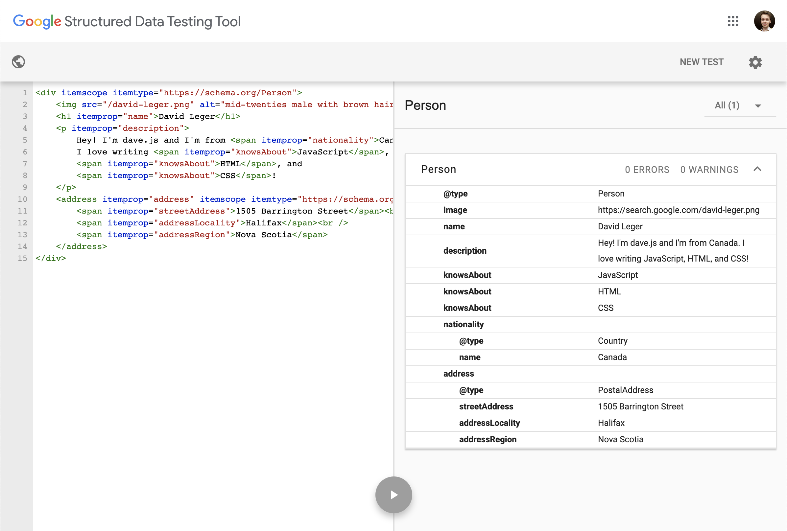

[Schema.org](https://schema.org) was an _unknown unknown_ to me for most of my time as a frontend developer. I have been building websites since 2010 and it was just over a year ago when I started at Manifold that I learned about its existence. Even as someone who keeps up with modern web development trends, Schema.org flew under my radar for far too long.  Why?

No one talks about it! Ever!

Well, now I am. 

## Overview

Established as an open standard by Google, Microsoft, Yahoo, and Yandex, Schema.org cut its v1 release _waaaay_ back in April 2013. Yes, it has really been around for _that_ long. However, it continues to evolve to support how people use the web in new and unpredictable ways.

So what the heck is it? According to the [Schema.org homepage](https://schema.org):

> Schema.org is a collaborative, community activity with a mission to create, maintain, and promote schemas for structured data on the Internet, on web pages, in email messages, and beyond.

In basic terms: Schema.org helps identify what web content actually means. It builds on the concepts of [semantic HTML elements](https://developer.mozilla.org/en-US/docs/Glossary/Semantics#Semantics_in_HTML "MDN - Semantics in HTML") and gives richer meaning to web content. 

Just like semantic HTML, Schema.org is great for search engine optimization (SEO). By giving more context to your content, search engines can better parse and categorize your content, making it easier for people to find it. Search engines can even use this structured data to create rich previews.

Another way to think of Schema.org is it’s like [ARIA](https://developer.mozilla.org/en-US/docs/Web/Accessibility/ARIA "MDN - Web Accessibility, ARIA"), but for SEO instead of accessibility. It doesn’t change the functionality of your website but enhances it for a specific audience (in this case, that audience is search engines).

## Adding Schema.org to HTML Content

Schema.org has standards for several encodings, however, the most likely one you’ll use is _Microdata_, which allows you to directly tag HTML with schema data via HTML attributes.

The API is quite simple. There are just three attributes:

* `itemtype`: Defines the schema of an item.
* `itemscope`: Defines the container of an item.
* `itemprop`: Defines a property on an item.

### Basic Usage

Here’s a simple example using the [Person Type](https://schema.org/Person "Schema.org - Person Type"):

    

    	
    	<h1 itemprop="name">David Leger</h1>
    	

    		Hey! I'm dave.js and I'm from Canada. 
    		I love writing JavaScript, 
            HTML, and 
            CSS!
    	

    

The `itemscope` and `itemtype` are placed on the top-level `
` so that every `itemprop` enclosed belongs to the Person type.

Notice how `description` wraps two additional `itemprop`s. Regardless of the level, `itemprops`s will apply to the closes ancestor with an `itemscope`. We can also define multiple of the same `itemprop` as shown with `knowsAbout`. 

### Nested Items

What if we want to nest items within an item though? For that, we can define a new `itemscope`. Let’s expand on our Person item and add a [PostalAddress](https://schema.org/PostalAddress "Schema.org - PostalAddress Type").

    

    	
    	<h1 itemprop="name">David Leger</h1>
    	
...

    	<address itemprop="address" itemscope itemtype="https://schema.org/PostalAddress">
    		1505 Barrington Street 
    		Halifax 
    		Nova Scotia
    	</address>
    

By adding `itemscope` to the `<address>` element, we are scoping all the `itemprop`s within that tag to the PostalAddress item. The PostalAddress is linked to the Person item by using `itemprop="address"`, without which they would be interpreted as completely separate entities.

### Hidden Data

Sometimes we want to give context to search engines that we don’t necessarily want to display on the page. This can be done using `<meta>` tags. This might seem a bit strange since `<meta>` tags are usually found in the `<head>` of a web page, but [Schema.org recommends using meta tags for implicit content](https://schema.org/docs/gs.html#advanced_missing "Schema.org - Getting started: missing content").

For the Person item, let’s add my nickname (dave.js) using a meta tag:

    

    	
    	<h1 itemprop="name">David Leger</h1>
    	
...

    	<address itemprop="address" itemscope itemtype="https://schema.org/PostalAddress">...</address>
    	<meta itemprop="alternateName" content="dave.js" />
    

## Testing Schema.org Items

Testing out your items is simple. Google offers a [Structured Data Testing Tool](https://search.google.com/structured-data/testing-tool) to validate your items. It parses your HTML and shows a tree of how the item attributes are interpreted. It also shows errors and warnings for missing properties that are required or recommended for each `itemtype`

Here’s our example parsed with the Structured Data Testing Tool.

## A Living Standard

Schema.org is an open-source community project. Although it is supported by major companies such as Google, Microsoft, Mozilla, and more, public contributions are encouraged. Although it’s been around since 2013, Schema.org is a living standard that adapts to the needs of the web. For example, recent releases included item types such as [CovidTestingFacility](https://schema.org/CovidTestingFacility "Schema.org - CovidTestingFacility Type") to help with pandemic relief efforts.

To learn more about Schema.org and its usage check out the [docs](https://schema.org/docs/documents.html "Schema.org - Documentation"). There are so many schemas for countless item types and detailed documentation on how to use them.

If you’d like to contribute to Schema.org head over to the [community page](https://www.w3.org/community/schemaorg/ "Schema.org Community Group") to see how you can help.