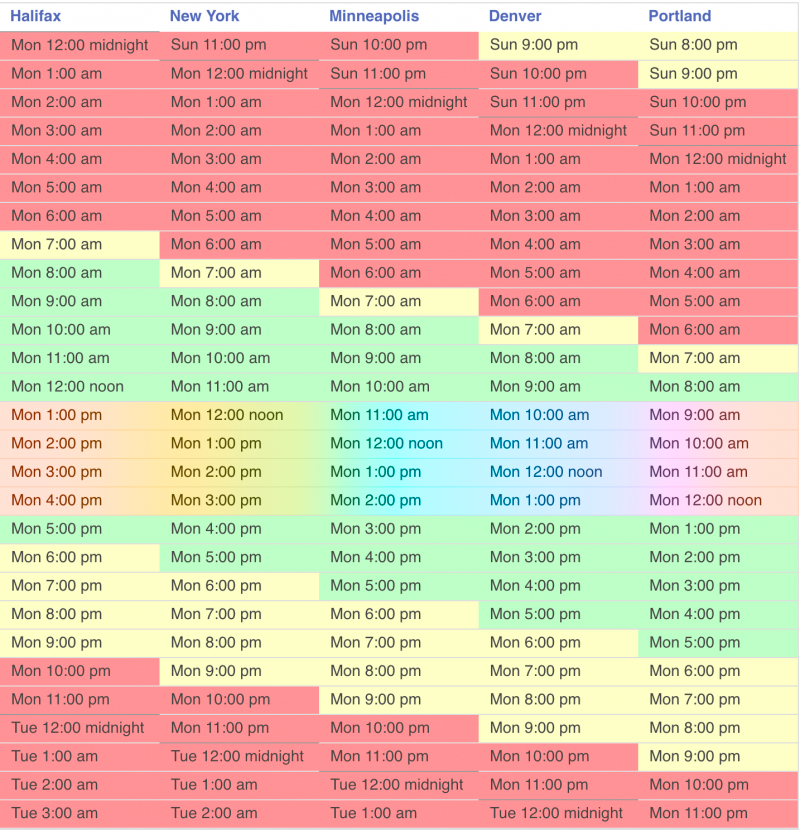

When the COVID-19 pandemic hit, companies all over the world started scrambling to figure out how to work remotely. We’ve seen a huge uptick in the popularity of apps like Slack and Zoom. While these apps help immensely with remote work, they don’t change the way we work. Slack is essentially faster email, and Zoom is analogous to in-person meetings. **Zoom and Slack are reactionary remote work solutions that are reminiscent of the good ol’ office life.** They bridge the remote communication gap is a familiar way, but are they effective?

I’ve worked on a distributed team for nearly my entire career as a software engineer. First, at Cvent where my team was scattered across the world. My team was primarily in India, with some team members in the United States, Russia, and Argentina. Meanwhile, I was based out of Atlantic Canada.

In my current role at Manifold, my team is distributed across all timezones in North America and we pride ourselves in having a remote-first culture.

> The physical separation of remote work isn’t the biggest issue — it’s the scheduling.

At this point, you might be realizing that the physical separation of remote work isn’t the biggest issue — it’s the scheduling. **A global team has to contend primarily with timezones, but also different national holidays, and occasionally extreme weather that impacts some team members’ ability to work and not others.** In our employee handbook, we have the _Manifold Rainbow Glow™️_ which shows appropriate hours for scheduling meetings that accommodate all timezones where we have employees. The rainbow section in the middle indicates times when it's okay to book meetings.

This leaves a four-hour window for meetings, but there's another catch. We also need to be careful to not book meetings that interfere with people's lunch break. To work around this, many of us have blocked time on our calendars for lunch. However, sometimes this leaves no options for meetings and someone has to make a sacrifice somewhere in their schedule.

But it's not only timezones that can cause scheduling conflicts. Even just the act of working remotely can create unforeseen interruptions that prevent people from attending meetings at a specific time. Family members, pets, and a variety of other things can sometimes require our attention without a moment's notice. (Sidenote: Critics of remote work will often use this as an argument against remote work. However, offices can but equally distracting in different ways such as coworkers chatting, playing ping-pong, etc.) It’s important when working in a remote environment that we are respectful of people’s unpredictable schedules as much as possible.

With scheduling issues being so tricky, we’ll often opt to share knowledge async via Slack or write up a document for others to read on their own time. This is often preferred over having a quick Zoom call, which would require the overhead of scheduling.

> Writing is hard. We often have trouble distilling thoughts and opinions into clear and concise words.

However, the tradeoff is the time required for writing and reading; a far more laborious effort than conversing. While writing is a great way to share knowledge, many of us are bad at it. **Writing is hard. We often have trouble distilling thoughts and opinions into clear and concise words.** And even those who have mastered the craft of writing spend a lot of time editing and revising to ensure their ideas are being communicated effectively.

> We lose a lot of informational throughput with writing, compared with speaking face-to-face.

Why is it so hard? We lose a lot of informational throughput with writing, compared with speaking face-to-face. We lose tone, emphasis, and body language — all of which help us communicate our ideas and intentions. When these important aspects of natural communication are stripped away, it’s simply harder to communicate effectively. **Writing lacks many of the tools we naturally use to communicate.** In this medium, we often struggle to connect.

Hours upon hours are spent crafting big walls of text on Slack that are then misinterpreted only to have you re-explain your thoughts with subsequent walls of text, or writing up seven- eight-page Google Docs that no one ends up reading.

More often than not, we’d be better off sharing this information in a meeting, right? But the scheduling issues I mentioned earlier often leave us no choice.

Once I had to schedule a 30-minute meeting where it took me literally hours to find a time that worked for everyone, and the time was two weeks away. Even then, two of eight people were unable to attend because their schedule changed.

**Meetings are hard. They don’t work for distributed teams.** But neither does Slack when we're trying to share big, complex, nuanced ideas with our team. Is there a way we maintain the information throughput of video conferencing while also making it async-friendly like Slack discussions?

_Yes!_

In my next post, I share \[how I use Loom to conquer remote communication\]([https://davejs.dev/conquering-remote-communication-with-loom/](https://davejs.dev/conquering-remote-communication-with-loom/ "Conquering Remote Communication with Loom")).